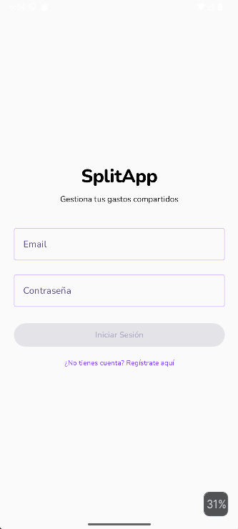

# Manual de Usuario — SplitApp

**Versión 1.0**  
**Proyecto de Fin de Grado — Desarrollo de Aplicaciones Multiplataforma**  
**Autor: Javier Aguilera Sánchez**

---

## Índice de contenidos

1. [Introducción](#1-introducción)
2. [Requisitos previos](#2-requisitos-previos)
3. [Registro de usuario](#3-registro-de-usuario)
4. [Inicio de sesión](#4-inicio-de-sesión)
5. [Pantalla principal](#5-pantalla-principal)
6. [Gestión de grupos](#6-gestión-de-grupos)
7. [Gestión de miembros](#7-gestión-de-miembros)
8. [Gestión de gastos](#8-gestión-de-gastos)
9. [Consulta de balances](#9-consulta-de-balances)
10. [Liquidación de deudas](#10-liquidación-de-deudas)
11. [Eliminación de gastos](#11-eliminación-de-gastos)
12. [Gestión del perfil](#12-gestión-del-perfil)
13. [Exportación de gastos](#13-exportación-de-gastos)
14. [Preguntas frecuentes (FAQ)](#14-preguntas-frecuentes-faq)
15. [Resolución de problemas](#15-resolución-de-problemas)
16. [Conclusión](#16-conclusión)

---

## 1. Introducción

### 1.1 Qué es SplitApp

SplitApp es una aplicación móvil nativa para dispositivos Android que permite gestionar gastos compartidos entre grupos de personas. Está diseñada para facilitar el seguimiento y la organización de los pagos realizados en contextos cotidianos como viajes, cenas, alquileres compartidos o cualquier situación en la que varias personas contribuyen económicamente a gastos comunes.

La aplicación permite registrar cada gasto indicando quién lo pagó y cómo debe repartirse entre los participantes, calcula automáticamente los balances de cada persona y proporciona una solución óptima para liquidar las deudas pendientes con el mínimo número de transferencias posible.

### 1.2 Objetivo de la aplicación

El objetivo principal de SplitApp es eliminar la complejidad y la fricción que surge al gestionar dinero entre varias personas. Con frecuencia, en un grupo de amigos o compañeros, resulta difícil recordar quién le debe dinero a quién, en qué cuantía y por qué concepto. SplitApp centraliza toda esta información en un único lugar accesible desde el teléfono móvil, actualizado en tiempo real para todos los miembros del grupo.

Los objetivos concretos de la aplicación son:

- Registrar gastos compartidos de forma sencilla e intuitiva.
- Calcular automáticamente el saldo de cada participante en el grupo.
- Simplificar las deudas existentes para minimizar el número de pagos necesarios.
- Proporcionar un historial exportable de los gastos del grupo.
- Ofrecer una experiencia de usuario clara, rápida y sin complicaciones innecesarias.

### 1.3 Público objetivo

SplitApp está dirigida a cualquier persona que comparta gastos de forma habitual con otras personas de su entorno: amigos que viajan juntos, compañeros de piso, familias que organizan eventos o cualquier grupo pequeño que necesite llevar un control económico compartido. No se requiere ningún conocimiento técnico para utilizar la aplicación.

---

## 2. Requisitos previos

Antes de instalar y utilizar SplitApp, es necesario disponer de lo siguiente:

### 2.1 Dispositivo Android

La aplicación está disponible para dispositivos Android con versión de sistema operativo **Android 6.0 (Marshmallow) o superior**. La gran mayoría de teléfonos inteligentes actuales son compatibles con este requisito.

Para verificar la versión de Android de su dispositivo, acceda a **Ajustes → Información del teléfono → Versión de Android**.

### 2.2 Conexión a Internet

SplitApp requiere conexión a Internet para funcionar, ya que los datos se sincronizan en tiempo real entre todos los miembros de un grupo. La aplicación es compatible tanto con redes Wi-Fi como con datos móviles (3G, 4G o 5G).

> **Nota:** Sin conexión a Internet no será posible registrar gastos, consultar balances ni acceder a ninguna funcionalidad de la aplicación.

### 2.3 Cuenta de correo electrónico

Para registrarse en SplitApp es necesario disponer de una dirección de correo electrónico válida. Se recomienda utilizar una cuenta de uso personal a la que tenga acceso habitual, ya que será el identificador principal de su cuenta.

---

## 3. Registro de usuario

### 3.1 Crear una cuenta

Al abrir SplitApp por primera vez, se mostrará la pantalla de bienvenida. Para comenzar a utilizar la aplicación es necesario crear una cuenta de usuario. Pulse el botón **"Crear cuenta"** o **"Registrarse"** para acceder al formulario de registro.

### 3.2 Introducir nombre de usuario

El primer campo del formulario solicita un **nombre de usuario**. Este nombre es el que verán los demás miembros de los grupos a los que pertenezca. Tenga en cuenta las siguientes restricciones:

- El nombre de usuario debe tener un máximo de **15 caracteres**.
- No se permiten espacios en el nombre de usuario.
- El nombre de usuario se almacena en minúsculas de forma automática; no importa si lo escribe en mayúsculas.
- El nombre de usuario debe ser único en la plataforma.

> **Recomendación:** Elija un nombre de usuario que sus contactos puedan reconocer fácilmente, ya que es el identificador que utilizarán para añadirle a grupos.

### 3.3 Correo electrónico

Introduzca su dirección de correo electrónico en el campo correspondiente. Asegúrese de que la dirección es correcta, ya que se utilizará para identificar su cuenta y para el proceso de inicio de sesión.

### 3.4 Contraseña

Introduzca una contraseña segura para proteger su cuenta. Se recomienda utilizar una combinación de letras, números y símbolos. La contraseña debe tener una longitud mínima de 6 caracteres.

> **Importante:** Guarde su contraseña en un lugar seguro. SplitApp no almacena contraseñas en texto plano y no es posible recuperarlas directamente.

### 3.5 Foto de perfil (opcional)

Durante el proceso de registro, o posteriormente desde la configuración del perfil, puede añadir una **fotografía de perfil**. Esta imagen es opcional y tiene como finalidad facilitar el reconocimiento visual entre los miembros de un grupo.

Para añadir una foto de perfil:

1. Pulse sobre el icono de cámara o el área destinada a la fotografía.
2. Seleccione una imagen de la galería de su dispositivo.
3. La imagen se cargará y quedará asociada a su perfil.

[Figura 2: Formulario de registro con los campos de nombre de usuario, correo, contraseña y foto de perfil]

Una vez completados todos los campos obligatorios, pulse el botón **"Registrarse"** para crear su cuenta. Si el registro se realiza correctamente, accederá automáticamente a la pantalla principal de la aplicación.

---

## 4. Inicio de sesión

### 4.1 Acceso a la aplicación

Si ya dispone de una cuenta en SplitApp, puede iniciar sesión desde la pantalla de bienvenida pulsando el botón **"Iniciar sesión"**. Introduzca los siguientes datos:

- **Correo electrónico:** la dirección de correo con la que se registró.
- **Contraseña:** la contraseña asociada a su cuenta.

Una vez introducidos los datos, pulse el botón **"Entrar"** para acceder a la aplicación.

[Figura 3: Pantalla de inicio de sesión con campos de correo electrónico y contraseña]

### 4.2 Recuperación de acceso

Si ha olvidado su contraseña, SplitApp ofrece la posibilidad de restablecerla a través del correo electrónico. Para ello:

1. En la pantalla de inicio de sesión, pulse sobre el enlace **"¿Has olvidado tu contraseña?"**.
2. Introduzca la dirección de correo electrónico asociada a su cuenta.
3. Recibirá un correo electrónico con instrucciones para restablecer su contraseña.
4. Siga las instrucciones del correo y establezca una nueva contraseña.
5. Una vez restablecida, podrá iniciar sesión con normalidad.

> **Nota:** Si no recibe el correo de recuperación, compruebe la carpeta de spam o correo no deseado de su cuenta de correo electrónico.

---

## 5. Pantalla principal

Tras iniciar sesión, accederá a la **pantalla principal** de SplitApp, que constituye el punto de entrada a todas las funcionalidades de la aplicación.

[Figura 4: Pantalla principal con lista de grupos y balance global]

### 5.1 Resumen global de balances

En la parte superior de la pantalla principal se muestra un **resumen de su situación económica global** en todos los grupos activos. Este resumen indica de un vistazo si usted tiene saldos positivos (le deben dinero), saldos negativos (usted debe dinero a otros) o si sus cuentas están equilibradas.

### 5.2 Lista de grupos

El área central de la pantalla muestra la **lista de grupos** a los que pertenece el usuario. Cada grupo aparece representado con su nombre y un indicador de su saldo actual dentro de ese grupo. Pulse sobre cualquier grupo para acceder a su detalle.

Si todavía no pertenece a ningún grupo, la lista aparecerá vacía y se mostrará un mensaje invitándole a crear o unirse a un grupo.

### 5.3 Acciones principales disponibles

Desde la pantalla principal puede realizar las siguientes acciones:

- **Crear un nuevo grupo:** mediante el botón flotante de acción (icono "+" situado en la parte inferior derecha de la pantalla).
- **Acceder al perfil:** pulsando sobre su foto de perfil o el icono de usuario situado habitualmente en la barra superior.
- **Consultar un grupo:** pulsando sobre cualquier grupo de la lista.

---

## 6. Gestión de grupos

Los grupos son el elemento central de SplitApp. Cada grupo representa un contexto compartido (por ejemplo, "Viaje a Roma", "Piso compartido" o "Cena de cumpleaños") dentro del cual se registran y reparten los gastos entre sus miembros.

### 6.1 Crear un grupo

Para crear un nuevo grupo:

1. Desde la pantalla principal, pulse el botón **"+"** (botón flotante de acción).
2. Se abrirá un formulario de creación. Introduzca los siguientes datos:
   - **Nombre del grupo** *(obligatorio):* un nombre descriptivo que identifique el propósito del grupo.
   - **Descripción** *(opcional):* una breve descripción que proporcione contexto adicional sobre el grupo.
3. Pulse **"Crear"** para confirmar.

El grupo se creará de forma inmediata y usted quedará registrado automáticamente como creador y miembro del mismo.

[Figura 5: Diálogo de creación de grupo con campos de nombre y descripción]

### 6.2 Unirse a un grupo

En la versión actual de SplitApp, la incorporación a un grupo se realiza mediante invitación directa: el creador o cualquier miembro con permisos puede buscar usuarios por nombre de usuario y añadirlos al grupo. Consulte la sección [Gestión de miembros](#7-gestión-de-miembros) para más información sobre este proceso.

### 6.3 Abandonar un grupo

Si desea dejar de pertenecer a un grupo, puede abandonarlo desde la pantalla de detalle del grupo. Tenga en cuenta que:

- Al abandonar un grupo, dejará de ver sus gastos y balances.
- Si tiene deudas pendientes dentro del grupo, se recomienda liquidarlas antes de abandonarlo.
- El historial de gastos registrados por usted permanecerá en el grupo.

### 6.4 Eliminar un grupo

Solo el **creador del grupo** tiene la posibilidad de eliminarlo. Al eliminar un grupo:

- Se eliminarán todos los gastos y datos asociados al grupo de forma permanente.
- Todos los miembros perderán el acceso al grupo y a su historial.

> **Advertencia:** Esta acción es **irreversible**. Asegúrese de que todos los balances están liquidados y de que todos los miembros están de acuerdo antes de proceder.

[Figura 6: Pantalla de detalle de grupo con opciones de gestión]

---

## 7. Gestión de miembros

### 7.1 Buscar usuarios

Para añadir una persona a un grupo, es necesario conocer su **nombre de usuario** en SplitApp. La búsqueda se realiza exclusivamente por nombre de usuario (no por correo electrónico), lo que protege la privacidad de los datos personales de los usuarios.

Desde la pantalla de detalle de un grupo, acceda a la sección de gestión de miembros y utilice el campo de búsqueda para encontrar al usuario que desea añadir. Los resultados se filtran en tiempo real a medida que escribe.

[Figura 7: Campo de búsqueda de usuarios por nombre de usuario]

### 7.2 Añadir miembros

Una vez localizado el usuario que desea incorporar al grupo:

1. Pulse sobre su nombre en los resultados de búsqueda.
2. El usuario quedará añadido al grupo de forma inmediata.
3. Recibirá acceso al grupo y podrá ver todos los gastos existentes desde ese momento.

> **Nota:** Solo los miembros ya pertenecientes al grupo pueden añadir nuevos miembros. La persona añadida verá el grupo en su pantalla principal la próxima vez que abra la aplicación o de forma automática si tiene la aplicación abierta.

[Figura 8: Confirmación de adición de un nuevo miembro al grupo]

### 7.3 Visualizar miembros del grupo

Desde la pantalla de detalle del grupo puede consultar la lista completa de miembros actuales. Para cada miembro se muestra:

- Su nombre de usuario.
- Su foto de perfil (si ha establecido una).
- Su saldo actual dentro del grupo.

---

## 8. Gestión de gastos

La gestión de gastos es la funcionalidad principal de SplitApp. Desde la pestaña **"Gastos"** dentro de la pantalla de detalle de un grupo puede registrar nuevos gastos y consultar el historial completo.

### 8.1 Registrar un gasto

Para registrar un nuevo gasto en un grupo:

1. Acceda al grupo desde la pantalla principal.
2. Pulse el botón **"+"** para añadir un nuevo gasto.
3. Se abrirá el formulario de registro de gastos.

[Figura 9: Formulario de registro de gasto]

#### 8.1.1 Concepto

Introduzca una descripción breve del gasto en el campo **"Concepto"**. Por ejemplo: "Cena del sábado", "Gasolina", "Alquiler de agosto". Este campo es obligatorio y servirá para identificar el gasto en el historial.

#### 8.1.2 Importe

Introduzca el importe total del gasto en el campo **"Importe"**. Utilice el punto o la coma como separador decimal según la configuración de su dispositivo. El importe debe ser un valor positivo mayor que cero.

#### 8.1.3 Pagador

En el campo **"Pagador"** seleccione el miembro del grupo que ha realizado el pago. Por defecto, aparecerá seleccionado el usuario que está registrando el gasto, pero puede cambiarlo si quien pagó fue otra persona.

#### 8.1.4 Participantes

Seleccione los miembros del grupo que participan en este gasto, es decir, aquellos entre quienes se repartirá el importe. Por defecto, aparecen seleccionados todos los miembros del grupo, pero puede desmarcar a quienes no participen en este gasto concreto.

#### 8.1.5 Reparto equitativo

Si todos los participantes deben pagar la misma cantidad, seleccione la opción **"Reparto equitativo"**. La aplicación dividirá automáticamente el importe total entre el número de participantes seleccionados, ajustando los céntimos si fuera necesario para que las cantidades sean exactas.

[Figura 10: Formulario de gasto con reparto equitativo seleccionado]

#### 8.1.6 Reparto personalizado

Si los participantes deben contribuir con cantidades diferentes, seleccione la opción **"Reparto personalizado"**. Se mostrarán dos modalidades:

- **Por importes:** introduzca manualmente el importe exacto que corresponde a cada participante. La suma de todos los importes debe ser igual al importe total del gasto.
- **Por porcentajes:** asigne un porcentaje a cada participante. La suma de todos los porcentajes debe ser igual al 100%.

La aplicación le indicará si los valores introducidos no cuadran con el total del gasto antes de permitir confirmar el registro.

[Figura 11: Formulario de gasto con reparto personalizado por importes]

#### 8.1.7 Confirmación del gasto

Una vez completados todos los campos, pulse el botón **"Guardar"** o **"Añadir gasto"** para confirmar el registro. El gasto aparecerá de forma inmediata en el historial del grupo y los balances de todos los participantes se actualizarán automáticamente.

---

## 9. Consulta de balances

La pestaña **"Balances"** dentro de la pantalla de detalle de un grupo muestra el estado económico actual de cada miembro respecto al grupo.

[Figura 12: Pantalla de balances del grupo]

### 9.1 Significado del saldo positivo

Un saldo **positivo** (habitualmente mostrado en color verde o con signo "+") indica que el grupo le debe dinero a ese miembro: ha pagado más de lo que le correspondía en los gastos compartidos.

> **Ejemplo:** Si su saldo es +15,00 €, significa que otros miembros del grupo le deben en total 15 euros.

### 9.2 Significado del saldo negativo

Un saldo **negativo** (habitualmente mostrado en color rojo o con signo "−") indica que ese miembro debe dinero al grupo: ha consumido más de lo que ha pagado.

> **Ejemplo:** Si su saldo es −8,50 €, significa que usted debe en total 8,50 euros a otros miembros del grupo.

### 9.3 Interpretación de la información mostrada

La pantalla de balances muestra el **saldo neto** de cada persona, no el detalle de cada deuda individual. Esto significa que la cifra que ve ya tiene en cuenta todos los gastos registrados en el grupo hasta ese momento.

La invariante que garantiza la aplicación es que la **suma de todos los saldos del grupo siempre es igual a cero**: el dinero que unos deben es exactamente el dinero que otros tienen pendiente de cobrar.

> **Nota:** Los balances se actualizan en tiempo real cada vez que se registra, modifica o elimina un gasto, por lo que siempre reflejan la situación más actual del grupo.

---

## 10. Liquidación de deudas

### 10.1 Qué hace la función

La función de liquidación de deudas analiza los saldos de todos los miembros del grupo y calcula el **conjunto mínimo de transferencias** necesario para que todos queden a cero. En lugar de que cada persona le transfiera dinero a todas las demás, el sistema propone una serie de pagos simplificados que resuelven todas las deudas con el menor número de transacciones posible.

### 10.2 Cómo se ejecuta

Desde la pestaña **"Balances"** del grupo, pulse el botón **"Liquidar deuda"** situado en la parte inferior de la pantalla. La aplicación calculará y registrará automáticamente las transacciones de liquidación.

[Figura 13: Pantalla de balances con el botón "Liquidar deuda" visible]

### 10.3 Resultado esperado

Tras ejecutar la liquidación:

- Se registrarán en el historial del grupo los pagos de compensación calculados por la aplicación.
- Los saldos de todos los miembros quedarán a **cero**, reflejando que todas las deudas han sido saldadas.
- Cada miembro podrá consultar exactamente a quién debe transferir dinero y en qué cantidad para que las cuentas queden equilibradas.

> **Importante:** La liquidación registra los pagos en la aplicación, pero **no realiza transferencias bancarias reales**. Los miembros deben efectuar los pagos de forma externa (Bizum, transferencia bancaria, efectivo, etc.) y después confirmarlos en la aplicación.

[Figura 14: Resultado de la liquidación con los pagos sugeridos]

---

## 11. Eliminación de gastos

### 11.1 Proceso

Si es necesario corregir o eliminar un gasto ya registrado, puede hacerlo desde el historial de gastos del grupo. Para eliminar un gasto:

1. Acceda a la pestaña **"Gastos"** del grupo correspondiente.
2. Localice el gasto que desea eliminar en la lista.
3. Pulse sobre el gasto para ver sus detalles o mantenga pulsado para acceder a las opciones disponibles.
4. Seleccione la opción **"Eliminar"**.

[Figura 15: Vista de detalle de un gasto con la opción de eliminación]

### 11.2 Confirmación requerida

Antes de proceder con la eliminación, la aplicación mostrará un **diálogo de confirmación** para evitar borrados accidentales. Deberá confirmar expresamente que desea eliminar el gasto pulsando el botón **"Eliminar"** en dicho diálogo. Si pulsa **"Cancelar"**, el gasto no se eliminará.

[Figura 16: Diálogo de confirmación de eliminación de gasto]

### 11.3 Actualización automática de balances

Una vez confirmada la eliminación, el gasto desaparece del historial de forma permanente y los **balances de todos los participantes afectados se recalculan y actualizan automáticamente** en tiempo real. No es necesario realizar ninguna acción adicional.

> **Advertencia:** La eliminación de un gasto es **irreversible**. Una vez eliminado, no podrá recuperarse.

---

## 12. Gestión del perfil

Desde la pantalla de perfil puede consultar y modificar la información asociada a su cuenta de usuario.

[Figura 17: Pantalla de perfil de usuario]

### 12.1 Cambiar nombre de usuario

Para cambiar su nombre de usuario:

1. Acceda a la pantalla de perfil desde el icono correspondiente en la pantalla principal.
2. Pulse sobre el campo de nombre de usuario o sobre el botón de edición.
3. Introduzca el nuevo nombre de usuario deseado, respetando las restricciones indicadas (máximo 15 caracteres, sin espacios).
4. Pulse **"Guardar"** para confirmar el cambio.

El nuevo nombre de usuario será visible para todos los miembros de sus grupos de forma inmediata.

[Figura 18: Edición del nombre de usuario en la pantalla de perfil]

### 12.2 Cambiar fotografía de perfil

Para cambiar su fotografía de perfil:

1. Acceda a la pantalla de perfil.
2. Pulse sobre su fotografía actual o sobre el icono de cámara superpuesto.
3. Seleccione una nueva imagen de la galería de su dispositivo.
4. La nueva fotografía se cargará y actualizará automáticamente en su perfil y en todos los grupos a los que pertenezca.

[Figura 19: Selección de nueva fotografía de perfil]

---

## 13. Exportación de gastos

SplitApp permite exportar el historial de gastos de un grupo en formato **CSV** (valores separados por comas), un formato compatible con hojas de cálculo como Microsoft Excel o Google Sheets.

### 13.1 Generación del archivo CSV

Para exportar el historial de gastos de un grupo:

1. Acceda al grupo cuyos gastos desea exportar.
2. Localice la opción **"Exportar gastos"** o el icono de exportación (habitualmente representado por una flecha hacia arriba o un icono de documento) en la barra superior o en el menú de opciones del grupo.
3. Pulse sobre dicha opción para generar el archivo.

[Figura 20: Botón de exportación de gastos en la pantalla del grupo]

### 13.2 Ubicación del archivo

El archivo CSV generado se guardará en el **almacenamiento interno del dispositivo**, en una carpeta accesible desde el gestor de archivos. La aplicación mostrará una notificación o un mensaje indicando la ruta exacta donde se ha guardado el archivo.

Podrá acceder al archivo desde el gestor de archivos de su dispositivo Android para abrirlo, compartirlo o transferirlo a otro dispositivo o servicio.

### 13.3 Utilidad del documento exportado

El archivo CSV exportado contiene el historial completo de gastos del grupo, incluyendo:

- Fecha de cada gasto.
- Concepto o descripción.
- Importe total.
- Nombre del pagador.
- Distribución del gasto entre los participantes.

Este documento puede ser útil para llevar un registro externo de los gastos, para compartir el historial con personas que no usan la aplicación, o como respaldo de la información en caso de necesidad.

[Figura 21: Ejemplo del contenido de un archivo CSV exportado abierto en una hoja de cálculo]

---

## 14. Preguntas frecuentes (FAQ)

### Inicio de sesión

**P: He olvidado mi contraseña. ¿Qué puedo hacer?**  
R: En la pantalla de inicio de sesión, pulse sobre el enlace "¿Has olvidado tu contraseña?" e introduzca su dirección de correo electrónico. Recibirá un mensaje con instrucciones para restablecer su contraseña. Si no lo recibe en unos minutos, revise la carpeta de spam.

**P: He olvidado el correo electrónico con el que me registré. ¿Puedo recuperar mi cuenta?**  
R: En la versión actual de SplitApp no es posible recuperar una cuenta sin conocer el correo electrónico de registro. Se recomienda registrarse siempre con una dirección de correo electrónico de uso habitual y personal.

**P: ¿Puedo usar SplitApp en varios dispositivos con la misma cuenta?**  
R: Sí. Puede iniciar sesión con su cuenta desde cualquier dispositivo Android compatible. Sus grupos, gastos y balances estarán sincronizados y disponibles en todos los dispositivos de forma automática.

---

### Grupos

**P: ¿Cuántos grupos puedo crear o en los que puedo participar?**  
R: No existe un límite establecido para el número de grupos. Puede crear y pertenecer a tantos grupos como necesite.

**P: ¿Puedo cambiar el nombre de un grupo después de crearlo?**  
R: Consulte las opciones disponibles en la pantalla de detalle del grupo. En función de la versión de la aplicación, esta opción puede estar disponible para el creador del grupo.

**P: Si abandono un grupo, ¿pierdo el historial de gastos?**  
R: Al abandonar un grupo dejará de tener acceso a su información. Sin embargo, el historial permanece intacto para el resto de miembros.

**P: ¿Puedo añadir a alguien que no tiene cuenta en SplitApp?**  
R: No. Para poder añadir a una persona a un grupo, esa persona debe estar registrada previamente en SplitApp y tener un nombre de usuario activo.

---

### Gastos

**P: ¿Puedo editar un gasto ya registrado?**  
R: En la versión actual, si necesita corregir un gasto incorrecto, la forma recomendada es eliminarlo y volver a registrarlo con los datos correctos.

**P: ¿Qué ocurre si el reparto personalizado no suma exactamente el total del gasto?**  
R: La aplicación mostrará un aviso indicando la diferencia y no permitirá guardar el gasto hasta que los valores cuadren correctamente con el importe total.

**P: ¿Puede el pagador ser alguien que no participa en el gasto?**  
R: Sí. El campo "Pagador" y los "Participantes" son independientes. Es posible que alguien pague un gasto del que no es beneficiario directo, aunque esta situación es poco habitual en la práctica.

**P: ¿Los gastos se actualizan en tiempo real para todos los miembros?**  
R: Sí. En cuanto un miembro registra un gasto, el resto de los miembros del grupo lo ven reflejado de forma inmediata en sus dispositivos, siempre que tengan conexión a Internet.

---

### Balances

**P: ¿Qué significa que mi balance sea 0,00 €?**  
R: Significa que sus pagos y su parte en los gastos del grupo están perfectamente equilibrados: no debe dinero a nadie ni nadie le debe a usted dentro de ese grupo.

**P: ¿Por qué mi balance ha cambiado si yo no he registrado ningún gasto?**  
R: Los balances cambian automáticamente cuando cualquier miembro del grupo registra, modifica o elimina un gasto en el que usted figura como participante o pagador.

**P: ¿La función de liquidar deuda realiza una transferencia bancaria automáticamente?**  
R: No. La liquidación calcula y registra los pagos compensatorios dentro de la aplicación, pero los miembros deben realizar las transferencias de dinero real por sus propios medios (Bizum, efectivo, transferencia bancaria, etc.).

---

### Exportación

**P: ¿Qué aplicación necesito para abrir el archivo CSV exportado?**  
R: El formato CSV es compatible con la mayoría de aplicaciones de hoja de cálculo: Microsoft Excel, Google Sheets, LibreOffice Calc, entre otras. También puede abrirse con cualquier editor de texto.

**P: ¿El archivo exportado incluye los balances o solo los gastos?**  
R: El archivo CSV contiene el historial de gastos registrados en el grupo. Para consultar los balances, utilice la pantalla de balances dentro de la aplicación.

---

## 15. Resolución de problemas

### 15.1 No puedo iniciar sesión

**Síntoma:** Al intentar iniciar sesión aparece un mensaje de error o la aplicación no responde.

**Posibles causas y soluciones:**

1. **Credenciales incorrectas:** Verifique que está introduciendo correctamente el correo electrónico y la contraseña. Tenga en cuenta que la contraseña distingue entre mayúsculas y minúsculas.
2. **Cuenta no verificada:** Si se registró recientemente, compruebe que no hay ningún paso de verificación de correo electrónico pendiente.
3. **Sin conexión a Internet:** Asegúrese de que su dispositivo tiene conexión a Internet activa. Intente abrir un navegador web para verificarlo.
4. **Contraseña olvidada:** Si no recuerda su contraseña, utilice la opción "¿Has olvidado tu contraseña?" para restablecerla.
5. **Problemas del servidor:** En ocasiones, los servicios de autenticación pueden experimentar interrupciones temporales. Espere unos minutos y vuelva a intentarlo.

---

### 15.2 No veo un grupo al que pertenezco

**Síntoma:** Un grupo en el que debería aparecer no se muestra en la lista de grupos de la pantalla principal.

**Posibles causas y soluciones:**

1. **Sin conexión a Internet:** Compruebe que su dispositivo tiene acceso a Internet. Los grupos se cargan desde el servidor en tiempo real y no están disponibles sin conexión.
2. **Sesión no actualizada:** Cierre la aplicación completamente y vuelva a abrirla. En algunos casos, la lista de grupos necesita refrescarse.
3. **No ha sido añadido correctamente:** Contacte con el creador o administrador del grupo para que verifique que su nombre de usuario fue añadido correctamente.
4. **Ha abandonado el grupo sin querer:** Si cree que pudo abandonar el grupo accidentalmente, solicite al creador que le vuelva a añadir.

---

### 15.3 No puedo añadir miembros a un grupo

**Síntoma:** La búsqueda de un usuario no devuelve resultados o no es posible añadirlo al grupo.

**Posibles causas y soluciones:**

1. **Nombre de usuario incorrecto:** Verifique que está escribiendo exactamente el nombre de usuario de la persona que desea añadir, respetando la ortografía (aunque no las mayúsculas, ya que el sistema las ignora).
2. **El usuario no está registrado:** La persona que desea añadir debe tener una cuenta activa en SplitApp. Si todavía no se ha registrado, invítele a hacerlo primero.
3. **El usuario ya es miembro:** Si el usuario ya pertenece al grupo, no aparecerá en los resultados de búsqueda para evitar duplicados.
4. **Sin conexión a Internet:** La búsqueda de usuarios requiere conexión a Internet. Compruebe su conectividad.

---

### 15.4 No se genera el archivo CSV

**Síntoma:** Al pulsar el botón de exportación, no se genera ningún archivo o aparece un mensaje de error.

**Posibles causas y soluciones:**

1. **Sin conexión a Internet:** La exportación puede requerir descargar los datos del servidor. Asegúrese de tener conexión activa.
2. **Sin gastos en el grupo:** Si el grupo no tiene ningún gasto registrado, el archivo CSV generado estará vacío o puede que la aplicación no lo genere. Registre al menos un gasto antes de exportar.
3. **Permisos de almacenamiento denegados:** SplitApp necesita permiso para escribir en el almacenamiento del dispositivo. Acceda a **Ajustes → Aplicaciones → SplitApp → Permisos** y compruebe que el permiso de almacenamiento está concedido.
4. **Almacenamiento lleno:** Verifique que su dispositivo dispone de espacio libre suficiente para guardar el archivo.

---

## 16. Conclusión

SplitApp es una herramienta diseñada para hacer más sencilla y transparente la gestión del dinero en grupo. Su filosofía se basa en la simplicidad: cada función existe para resolver un problema concreto del día a día, sin complicaciones innecesarias.

A lo largo de este manual se han descrito todas las funcionalidades disponibles en la aplicación: desde el registro y el inicio de sesión, hasta la gestión de grupos y miembros, el registro y reparto de gastos, la consulta de balances en tiempo real, la liquidación optimizada de deudas y la exportación del historial a un formato externo.

SplitApp garantiza que la suma de los saldos del grupo siempre es cero, que los balances se actualizan en tiempo real para todos los miembros y que la liquidación de deudas minimiza el número de transferencias necesarias para equilibrar las cuentas. Todo ello con una experiencia de usuario fluida, clara y accesible para cualquier persona, independientemente de su nivel de conocimiento tecnológico.

Se espera que este manual sirva como referencia completa para los usuarios de SplitApp y facilite el aprovechamiento de todas sus capacidades desde el primer uso.

---

*Manual de Usuario — SplitApp v1.0*  
*Documento generado como parte del Proyecto de Fin de Grado — DAM*  
*Autor: Javier Aguiar — 2026*
